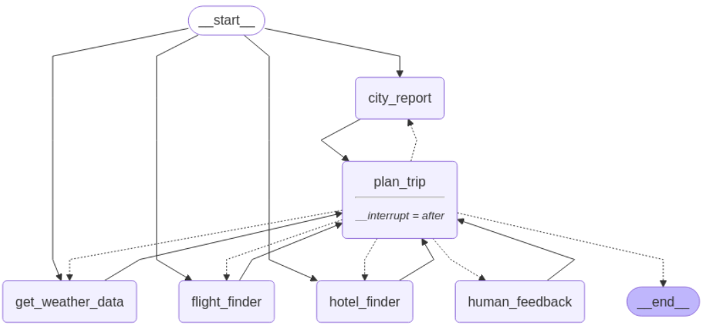
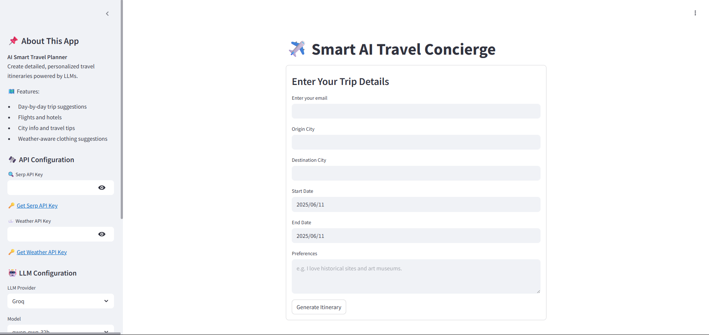

---
# 🧳 Trip Itinerary Planner

A conversational trip itinerary planner built with [LangGraph](https://langchain-ai.github.io/langgraph/tutorials/introduction/) and custom LangChain tools. Easily plan your next trip by getting weather forecasts, flight and hotel options, and detailed city insights—all from a single, natural-language interface.

---

# 🗺️ How the Langgraph Graph Looks


---

# UI Interface


---


# 🚀 Features

- **Weather Forecasts**  
  Fetch current and future weather via **WeatherAPI**.
- **Flight Search**  
  Discover flight options via **Google SERP API**.
- **Hotel Search**  
  Browse hotel options via **Google SERP API**.
- **City Information**  
  Retrieve detailed city data (history, attractions, travel tips) via **DuckDuckGoSearchRun**.
- **Email Notifications**  
  Send your planned trip itinerary directly to your inbox.

---

# 🏗️ Architecture
```bash
Trip_planner_graph/
├── .env                        # Store secret keys and credentials.
├── .venv/                      # Python virtual environment directory.
├── app.py                      # Application entrypoint: initializes and runs the FastAPI/Flask server.
├── requirements.txt            # Pin project’s Python dependencies.
├── template.py                 # Scaffolding script: bootstraps all folders & stub files.
├── Dockerfile                  # Creating docker image for your code.
├── assets/                     # Contain images that used in the project.              
│   └── graph.png               # Langgraph Graph image for this project.
├── .github/                    # GitHub configuration directory.
│   └── workflows/
│       └── main.yml            # GitHub Actions: CI/CD to deploy to Hugging Face Space.
└── src/                        # Main application source code.
    ├── __init__.py             # Marks `src/` as a Python package.
    ├── graph/                  # Graph orchestration layer.
    │   ├── __init__.py         # Marks `graph/` as a package.
    │   └── built_graph.py      # LangGraph entry point: builds & runs the planning graph
    ├── llms/                   # LLM configuration & wrappers
    │   ├── __init__.py         # Marks `llms/` as a package
    │   └── llms.py             # Instantiates and configures LLM clients (OpenAI, etc.)
    ├── mail/                   # Email integration
    │   ├── __init__.py         # Marks `mail/` as a package
    │   └── email.py            # Functions to format and send itinerary emails
    ├── tools/                  # External tool wrappers (API clients)
    │   ├── __init__.py         # Marks `tools/` as a package
    │   ├── city.py             # Lookup city metadata (population, timezone, sights)
    │   ├── flight.py           # Search & book flights via some flight-API
    │   ├── hotel.py            # Search & book hotels via some hotel-API
    │   └── weather.py          # Fetch weather forecasts for itinerary dates
    ├── state/                  # Application state management
    │   ├── __init__.py         # Marks `state/` as a package
    │   └── custom_state.py     # Persistence layer: caches intermediate results
    └── planner/                # Core trip-planning logic
        ├── __init__.py         # Marks `planner/` as a package
        └── plan.py             # Functions that assemble flights, hotels, and activities into a plan

```
---

# ⚙️ Installing Dependencies

Ensure you have UV installed. You can install UV via:

- On macOS/Linux:

```bash
curl -LsSf https://astral.sh/uv/install.sh | sh
```
- On Windows

```bash
powershell -ExecutionPolicy ByPass -c "irm https://astral.sh/uv/install.ps1 | iex"
```
- Or via pip

```bash
pip install uv
```

### Install Python-3.12 version
```bash
uv venv --python 3.12
```

### Activating the Virtual Environment 

- macOS/Linux
```bash
source .venv/bin/activate
```

- Windows (PowerShell)

```bash
.venv\Scripts\Activate
```

### Single Packages
```bash
uv pip install <package_name>
```

### From a requirements.txt File
```bash
uv pip install -r requirements.txt
```

### To capture the exact versions of all installed packages, generate a lockfile:
```bash
uv lock
```

### To recreate your environment elsewhere (e.g. on CI or another machine), install exactly what’s in the lockfile:

```bash
uv sync
```
---

# 💻 How To Run on Your System

- Clone This Repository 

```bash
git clone https://github.com/Dhruv-saxena-25/Trip_planner_graph.git
```

- Create a virtul environment and activate it. (Steps already mentioned above.)

```bash
uv pip install -r requirements.txt 
```

- Run `app.py` file

```bash
streamlit run app.py 
```
---

<!-- - Add `.env` file and inside that .env add your secret keys -->

# 🔑 Email Configuration

- To enable email functionality in this project (using Gmail)

1) EMAIL: This is the mail address from which emails will be sent. 

2) EMAIL_KEY: App specif password. (In this project how you can get. Enable 2FA → Security → App passwords → Mail + Device “Python” → Generate → Copy 16-char password → Paste this in you .env file.)
```bash
EMAIL = "******@gmail.com"   
EMAIL_KEY = "**** **** **** ****"
```
---

# 🐳 Docker Support
- Want to run the project in a Docker container?

### Pull the Docker image:
```bash
docker pull dhruv89/trip_planner:latest
```
### Run the container:

```bash
docker run -p 8501:8501 dhruv89/trip_planner

```
- This runs the Streamlit app and exposes it on port 8501.

---
# 🚀 Deployment Link

The project is live and accessible at the following link:

👉 Try it now: [Trip Itinerary Planner on Hugging Face Spaces](https://huggingface.co/spaces/Dhruv2508/Travel_concierge) 